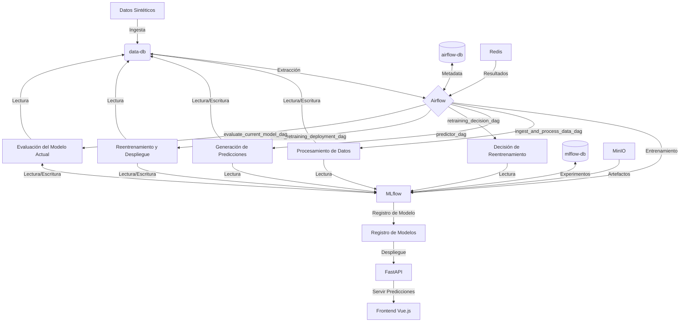

# Sistema de Predicción de Peso de Camiones

## Justificación del Proyecto

Este proyecto se ha desarrollado como una solución anticipada para un posible proyecto futuro de predicción de peso de camiones, utilizando datos sintéticos debido a la falta de datos históricos reales. Esta decisión se basa en:

1. Preparación Anticipada: Nos posicionamos para una rápida implementación cuando el proyecto real se materialice.
2. Prueba de Concepto: Demostramos la viabilidad y el potencial del sistema.
3. Desarrollo Iterativo: Permite mejorar continuamente sin las limitaciones de datos reales incompletos.
4. Flexibilidad en el Diseño: Creamos un sistema adaptable a diferentes escenarios potenciales.

El sistema está diseñado para adaptarse fácilmente a datos reales cuando estén disponibles.

## Descripción del Problema y Objetivos

El proyecto busca predecir el peso total de los camiones para los próximos 30 días, crucial para la planificación logística y la optimización de operaciones de transporte.

### Objetivos Principales

1. Desarrollar un modelo de aprendizaje automático preciso.
2. Implementar un pipeline automatizado para procesamiento, entrenamiento y despliegue.
3. Crear un sistema de monitoreo y reentrenamiento continuo.
4. Proporcionar una interfaz para acceder y visualizar predicciones.

## Infraestructura y Arquitectura

- Almacenamiento: PostgreSQL con SQLAlchemy ORM
- Desarrollo de Modelos: MLflow y XGBoost
- Orquestación: Apache Airflow con DAGs
- Despliegue: Docker y Docker Compose
- API: FastAPI
- Frontend: Vue.js

## Tipo de Despliegue: Procesamiento por Lotes

El sistema genera predicciones en lote:

1. Entrenamiento con datos históricos.
2. Generación de predicciones para 30 días.
3. Almacenamiento en base de datos.
4. API sirve predicciones pre-calculadas.

Este enfoque es adecuado porque:
- No requiere actualizaciones en tiempo real.
- Permite uso eficiente de recursos computacionales.
- Asegura tiempos de respuesta rápidos.

## Monitoreo y Reentrenamiento Automatizado

- Evaluación diaria del rendimiento (R²)
- Registro de métricas con MLflow
- DAGs para decisión y ejecución de reentrenamiento
- Reentrenamiento automático si R² < 0.9 durante más de 3 días en una semana

## Elección de Datos Sintéticos

Los datos sintéticos permiten:
1. Simular patrones realistas de peso de camiones.
2. Crear un conjunto de datos suficiente para entrenamiento y pruebas.
3. Incorporar variaciones estacionales y eventos especiales.
4. Controlar las características de los datos para probar diferentes escenarios.

## Áreas de Mejora

1. Uso de datos reales
2. Técnicas avanzadas de feature engineering
3. Experimentación con modelos más sofisticados
4. Sistema de monitoreo más robusto
5. Optimización del rendimiento
6. Refuerzo de seguridad y cumplimiento normativo
7. Mejora de escalabilidad
8. Interfaz de usuario más avanzada
9. Integración con sistemas externos
10. Pruebas más exhaustivas

## Detalles de la Implementación

### Docker Compose

Servicios principales:
- Bases de datos (data-db, airflow-db, mlflow-db)
- Redis
- Airflow (webserver, scheduler, worker, triggerer)
- MLflow
- MinIO
- API de predicciones
- Frontend

### Generación de Datos Sintéticos

La generación de datos sintéticos es crucial para este proyecto, ya que simula patrones realistas de peso de camiones en ausencia de datos históricos reales. Esta funcionalidad está implementada en `utils/ml_helpers.py` y tiene en cuenta varios factores para crear un conjunto de datos que refleje la complejidad del mundo real:

```python
def generate_total_weight(truck_id, day_of_week, month, day_of_year):
    base_weight = truck_capacities[truck_id - 1] * truck_reliability[truck_id - 1]

    # Weekend effect
    if day_of_week in [5, 6]:
        base_weight *= weekend_multipliers[day_of_week - 5]

    # Seasonal effect (assuming Southern Hemisphere)
    season_effect = np.sin(2 * np.pi * day_of_year / 365) * 200 + 200
    base_weight += season_effect

    # Monthly variation
    base_weight += monthly_variations[month - 1]

    # Special events (e.g., holidays)
    if month == 12 and day_of_year >= 350:  # Christmas period
        base_weight *= christmas_multipliers[day_of_year - 350 - 1]

    # Long-term trend (slight increase over time)
    trend = day_of_year * 0.5
    base_weight += trend

    # Ensure weight is between 500 and 4000 kg
    return max(500, min(4000, round(base_weight, 2)))
```

Los datos sintéticos generados intentan simular varios patrones y factores:

1. **Características del Camión**: Cada camión tiene una capacidad y fiabilidad específica, lo que afecta su peso base.

2. **Efecto de Fin de Semana**: Se aplican multiplicadores especiales para los viernes y sábados, simulando posibles cambios en la carga durante los fines de semana.

3. **Efecto Estacional**: Se utiliza una función sinusoidal para simular cambios estacionales en el peso, asumiendo un hemisferio sur (con picos en verano y valles en invierno).

4. **Variaciones Mensuales**: Cada mes tiene una variación específica que se añade al peso base, reflejando posibles patrones mensuales en la demanda o en las operaciones.

5. **Eventos Especiales**: Se incluye un efecto especial para el período navideño (últimos días de diciembre), aplicando multiplicadores que podrían representar un aumento en la carga debido a la temporada festiva.

6. **Tendencia a Largo Plazo**: Se añade una ligera tendencia al alza a lo largo del año, lo que podría representar un crecimiento gradual en el volumen de carga.

7. **Límites Realistas**: El peso final se limita entre 500 y 4000 kg para mantener valores dentro de un rango realista para camiones de carga.

Esta aproximación a la generación de datos sintéticos permite crear un conjunto de datos que exhibe patrones complejos y realistas, ideal para entrenar y probar el modelo de predicción. Además, proporciona la flexibilidad necesaria para ajustar estos patrones según sea necesario, permitiendo simular diferentes escenarios y probar la robustez del modelo bajo diversas condiciones.

### DAGs de Airflow

1. `ingest_and_process_data_dag.py`: Ingesta y procesamiento diario
2. `predictor_dag.py`: Generación de predicciones
3. `retraining_decision_dag.py`: Evaluación de rendimiento
4. `model_retraining_deployment_dag.py`: Reentrenamiento y despliegue

### API de Predicciones

La API de predicciones está implementada utilizando FastAPI en `predictions_api/main.py`. Actualmente, la API ofrece un único endpoint que devuelve las predicciones para todos los camiones en los próximos 30 días:

```python
@app.get("/predictions", response_model=list[PredictionResponse])
async def get_predictions():
    db = SessionLocal()
    try:
        today = date.today()
        predictions = db.query(Prediction).filter(Prediction.date >= today).all()
        return predictions
    except Exception as e:
        raise HTTPException(status_code=500, detail=str(e))
    finally:
        db.close()
```

Este endpoint proporciona una vista general de todas las predicciones disponibles. Sin embargo, en futuras iteraciones, la API podría mejorarse para soportar consultas más específicas y flexibles. Algunas posibles mejoras incluyen:

1. Filtrado por camión: Permitir a los usuarios obtener predicciones para camiones específicos.
2. Filtrado por fecha: Habilitar la consulta de predicciones para rangos de fechas personalizados.
3. Paginación: Implementar paginación para manejar grandes volúmenes de datos de manera más eficiente.
4. Ordenamiento: Permitir a los usuarios ordenar los resultados por diferentes criterios (por ejemplo, fecha, peso predicho, ID del camión).
5. Agregaciones: Ofrecer endpoints para obtener estadísticas agregadas, como el peso total predicho por día o por camión.

Ejemplo de un posible endpoint futuro con filtros:

```python
@app.get("/predictions/filtered", response_model=list[PredictionResponse])
async def get_filtered_predictions(
    start_date: date = Query(None),
    end_date: date = Query(None),
    truck_id: int = Query(None),
    limit: int = Query(100, le=1000),
    offset: int = Query(0, ge=0)
):
    db = SessionLocal()
    try:
        query = db.query(Prediction)
        if start_date:
            query = query.filter(Prediction.date >= start_date)
        if end_date:
            query = query.filter(Prediction.date <= end_date)
        if truck_id:
            query = query.filter(Prediction.truck_id == truck_id)
        
        total = query.count()
        predictions = query.offset(offset).limit(limit).all()
        
        return {
            "total": total,
            "predictions": predictions
        }
    except Exception as e:
        raise HTTPException(status_code=500, detail=str(e))
    finally:
        db.close()
```

Estas mejoras permitirían a los usuarios de la API obtener datos más específicos y relevantes para sus necesidades, mejorando la utilidad y flexibilidad del sistema de predicción.

### Base de Datos data-db

Almacena datos brutos y predicciones con tablas optimizadas e indexadas:

```sql
CREATE TABLE IF NOT EXISTS raw_data (
    id BIGSERIAL PRIMARY KEY,
    date DATE,
    truck_id INTEGER,
    total_weight FLOAT,
    day_of_week INTEGER,
    month INTEGER,
    day_of_year INTEGER,
    UNIQUE (truck_id, date)
);

CREATE INDEX idx_raw_data_truck_id ON raw_data(truck_id);
CREATE INDEX idx_raw_data_date ON raw_data(date);
```

### Tests

Incluidos en el pipeline CI/CD:

```yaml
    - name: Format with Black
      run: black airflow/dags/ predictions_api/

    - name: Lint with flake8
      run: flake8 airflow/dags/ predictions_api/

    - name: Check DAG integrity
      run: |
        PYTHONPATH=$PYTHONPATH:${{ github.workspace }}/airflow/dags python -c "from airflow.models import DagBag; import os; dag_folder = os.path.join(os.getcwd(), 'airflow', 'dags'); db = DagBag(dag_folder=dag_folder, include_examples=False); assert len(db.import_errors) == 0, db.import_errors"

    - name: Run pytest
      run: pytest
```

## Diagrama de Arquitectura



## Conclusión

Este proyecto implementa un sistema completo de predicción de peso de camiones, desde la generación de datos sintéticos hasta la visualización de predicciones, utilizando tecnologías modernas para crear una solución robusta y escalable.