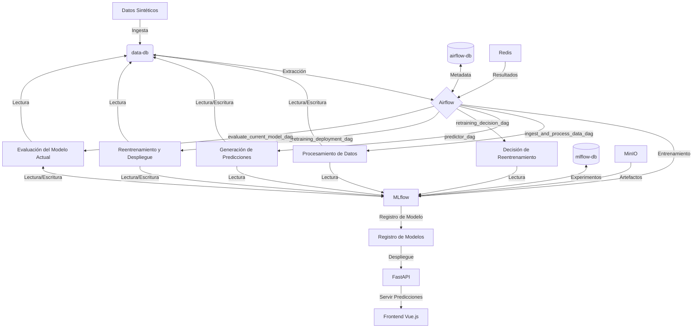

# Sistema de Predicción de Peso de Camiones

## Descripción del Problema y Objetivos

Este proyecto tiene como objetivo resolver el desafío de predecir el peso total de los camiones para los próximos 30 días. Esta predicción es crucial para la planificación logística, la asignación de recursos y la optimización de las operaciones de transporte.

### Objetivos Principales

1. Desarrollar un modelo de aprendizaje automático para predecir con precisión los pesos de los camiones.
2. Implementar un pipeline automatizado para el procesamiento de datos, entrenamiento de modelos y despliegue.
3. Crear un sistema para el monitoreo continuo y reentrenamiento del modelo para mantener su precisión a lo largo del tiempo.
4. Proporcionar una interfaz fácil de usar para acceder y visualizar las predicciones.

## Infraestructura y Arquitectura

### Almacenamiento y Procesamiento de Datos

- Base de datos PostgreSQL para almacenar datos brutos y predicciones
- SQLAlchemy ORM para interacciones con la base de datos

### Desarrollo y Experimentación de Modelos

- MLflow para el seguimiento de experimentos y versionado de modelos
- XGBoost como el algoritmo principal de aprendizaje automático

### Orquestación y Automatización

- Apache Airflow para la orquestación de flujos de trabajo
- DAGs (Grafos Acíclicos Dirigidos) para definir y gestionar tareas

### Despliegue

- Docker para la contenerización de servicios
- Docker Compose para el despliegue de aplicaciones multi-contenedor

### API y Frontend

- FastAPI para crear una API RESTful que sirva las predicciones
- Vue.js para construir un frontend interactivo para visualizar las predicciones

## Tipo de Despliegue: Procesamiento por Lotes

El sistema utiliza un enfoque de procesamiento por lotes para generar predicciones:

1. El modelo se entrena con datos históricos.
2. Las predicciones para los próximos 30 días se generan en lote.
3. Estas predicciones se almacenan en la base de datos.
4. La API sirve estas predicciones pre-calculadas.

Este enfoque es adecuado para nuestro caso de uso ya que:

- Las predicciones de peso de los camiones no requieren actualizaciones en tiempo real.
- El procesamiento por lotes permite un uso eficiente de los recursos computacionales.
- Las predicciones pre-calculadas aseguran tiempos de respuesta rápidos para la API.

## Monitoreo y Reentrenamiento Automatizado

### Monitoreo de Rendimiento

- Evaluación diaria del rendimiento del modelo utilizando la puntuación R²
- Registro de métricas de rendimiento utilizando MLflow

### Reentrenamiento Automatizado

Dos DAGs principales manejan el proceso de reentrenamiento:

1. `retraining_decision_dag`: Verifica el rendimiento del modelo diariamente y activa el reentrenamiento si es necesario.
2. `model_retraining_deployment_dag`: Maneja el reentrenamiento real y el despliegue del nuevo modelo.

El sistema activa automáticamente el reentrenamiento si el rendimiento del modelo cae por debajo de un cierto umbral (R² < 0.9) durante más de 3 días en una semana.

## Detalles de la Implementación

### Docker Compose

El archivo `docker-compose.yaml` define todos los servicios necesarios para el proyecto. Aquí está un resumen de los servicios principales con sus puertos correspondientes:

1. `data-db`: Base de datos PostgreSQL para almacenar datos brutos y predicciones.
2. `airflow-db`: Base de datos PostgreSQL para Airflow.
3. `redis`: Utilizado por Airflow como backend de resultados.
4. `airflow-webserver`: Puerto 8080 - Interfaz web de Airflow.
5. `airflow-scheduler`, `airflow-worker`, `airflow-triggerer`: Componentes de Apache Airflow.
6. `mlflow-db`: Base de datos PostgreSQL para MLflow.
7. `mlflow`: Puerto 5000 - Servidor MLflow para el seguimiento de experimentos y registro de modelos.
8. `minio`: Puertos 9000 (API) y 9001 (Console) - Almacenamiento de objetos compatible con S3 para artefactos de MLflow.
9. `predictions-api`: Puerto 8000 - API FastAPI para servir predicciones.
10. `predictions-api-consumer`: Puerto 8001 - Frontend Vue.js para visualizar predicciones.

Cada servicio está configurado con sus propias variables de entorno, volúmenes y dependencias.

### Generación de Datos Sintéticos

Los datos utilizados en este proyecto son sintéticos y se generan para simular patrones realistas. El script `utils/ml_helpers.py` contiene la lógica para generar estos datos:

```python
def get_or_create_random_values(trucks=10):
    try:
        random_values = load_data_from_s3(AWS_S3_BUCKET, "random_values.json")
        random_values = json.loads(random_values)
    except (json.JSONDecodeError, Exception):
        random_values = {
            "truck_capacities": np.random.uniform(1500, 3000, trucks).tolist(),
            "truck_reliability": np.random.uniform(0.8, 1.2, trucks).tolist(),
            # Sábado y domingo
            "weekend_multipliers": np.random.uniform(1.1, 1.2, 2).tolist(),
            "monthly_variations": np.random.normal(0, 100, 12).tolist(),  # Una por mes
            # Para los últimos 15 días del año
            "christmas_multipliers": np.random.uniform(1.2, 1.4, 15).tolist(),
        }
        save_data_to_s3(json.dumps(random_values), AWS_S3_BUCKET, "random_values.json")

    return random_values
```

Este código genera valores aleatorios para:
- Capacidades de los camiones
- Fiabilidad de los camiones
- Multiplicadores para fines de semana
- Variaciones mensuales
- Multiplicadores para la temporada navideña

Estos valores se utilizan luego para generar datos que simulan patrones realistas, incluyendo:
- Diferencias entre camiones individuales
- Aumento de peso en fines de semana
- Variaciones estacionales
- Aumento significativo durante la temporada navideña y de fin de año

### DAGs de Airflow

1. `ingest_and_process_data_dag.py`: Ingesta y procesa datos diariamente, detecta drift de datos y activa reentrenamiento si es necesario.
2. `predictor_dag.py`: Genera predicciones diarias para los próximos 30 días utilizando el modelo actual.
3. `retraining_decision_dag.py`: Evalúa el rendimiento del modelo y decide si se necesita reentrenamiento.
4. `model_retraining_deployment_dag.py`: Realiza el reentrenamiento del modelo y lo despliega si es necesario.

### API de Predicciones

La API de predicciones está implementada utilizando FastAPI y se encuentra en el archivo `predictions_api/main.py`. Esta API lee las predicciones generadas por el `predictor_dag` y las sirve a través de un endpoint REST.

```python
@app.get("/predictions", response_model=list[PredictionResponse])
async def get_predictions():
    db = SessionLocal()
    try:
        today = date.today()
        predictions = db.query(Prediction).filter(Prediction.date >= today).all()
        return predictions
    except Exception as e:
        raise HTTPException(status_code=500, detail=str(e))
    finally:
        db.close()
```

Este endpoint devuelve las predicciones para los próximos 30 días, que se generan y almacenan en la base de datos `data-db`.

### Base de Datos data-db

La base de datos `data-db` se utiliza tanto para almacenar los datos brutos (`raw_data`) como las predicciones generadas. Los scripts de inicialización en la carpeta `init-scripts` crean las tablas necesarias:

```sql
CREATE TABLE IF NOT EXISTS raw_data (
    id BIGSERIAL PRIMARY KEY,
    date DATE,
    truck_id INTEGER,
    total_weight FLOAT,
    day_of_week INTEGER,
    month INTEGER,
    day_of_year INTEGER,
    UNIQUE (truck_id, date)  -- Agregar restricción de clave única
);

CREATE INDEX idx_raw_data_truck_id ON raw_data(truck_id);
CREATE INDEX idx_raw_data_date ON raw_data(date);
```

```sql
CREATE TABLE IF NOT EXISTS predictions (
    id BIGSERIAL PRIMARY KEY,
    date DATE,
    truck_id INTEGER,
    predicted_weight FLOAT,
    UNIQUE (truck_id, date)  -- Agregar restricción de clave única
);

CREATE INDEX idx_predictions_truck_id ON predictions(truck_id);
CREATE INDEX idx_predictions_date ON predictions(date);
```

Estas tablas están diseñadas con índices para optimizar las consultas y restricciones de unicidad para evitar duplicados.

### Tests

Los tests se ejecutan como parte del pipeline de CI/CD definido en `.github/workflows/ci.yml`. Los principales pasos de testing incluyen:

1. Formateo de código con Black
2. Linting con flake8
3. Verificación de integridad de los DAGs de Airflow
4. Ejecución de pruebas unitarias con pytest

```yaml
    - name: Format with Black
      run: black airflow/dags/ predictions_api/

    - name: Lint with flake8
      run: flake8 airflow/dags/ predictions_api/

    - name: Check DAG integrity
      run: |
        PYTHONPATH=$PYTHONPATH:${{ github.workspace }}/airflow/dags python -c "from airflow.models import DagBag; import os; dag_folder = os.path.join(os.getcwd(), 'airflow', 'dags'); db = DagBag(dag_folder=dag_folder, include_examples=False); assert len(db.import_errors) == 0, db.import_errors"

    - name: Run pytest
      run: pytest
```

Estos tests aseguran que el código esté formateado correctamente, libre de errores de sintaxis, y que los DAGs de Airflow sean válidos.

## Diagrama de Arquitectura



Este diagrama muestra cómo los diferentes componentes del sistema interactúan entre sí, incluyendo los DAGs de Airflow, las bases de datos, MLflow, y los servicios de frontend y backend.

## Conclusión

Este proyecto implementa un sistema completo de predicción de peso de camiones, desde la generación de datos sintéticos hasta la visualización de predicciones, pasando por el entrenamiento de modelos, monitoreo de rendimiento y reentrenamiento automático. Utiliza tecnologías modernas como Docker, Airflow, MLflow y FastAPI para crear una solución robusta y escalable.